# project-1

## 1. 文件说明

- static：存放 js 和 css
- templates： 各种 jinja 模板
  - errors：自定义 404 和 500 错误页面
- app.py：应用入口
- commands.py：定义了初始化数据库和导入数据的 flask 命令
- errors.py：HTTP错误处理器
- forms.py：各种表单类
- models.py：数据库实体类
- settings.py：配置文件
- views.py：Flask 视图文件
- books.csv：图书原始数据

## 2. 数据库

1. 初始化数据库

   ```bash
   flask initdb --drop
   ```

   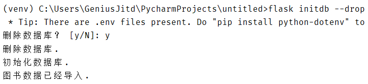

2. 数据表

   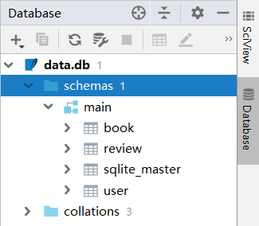

3. 各表的结构

   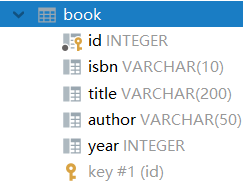

   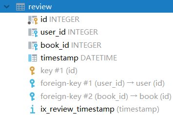

   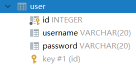

   

## 界面展示

### 首页

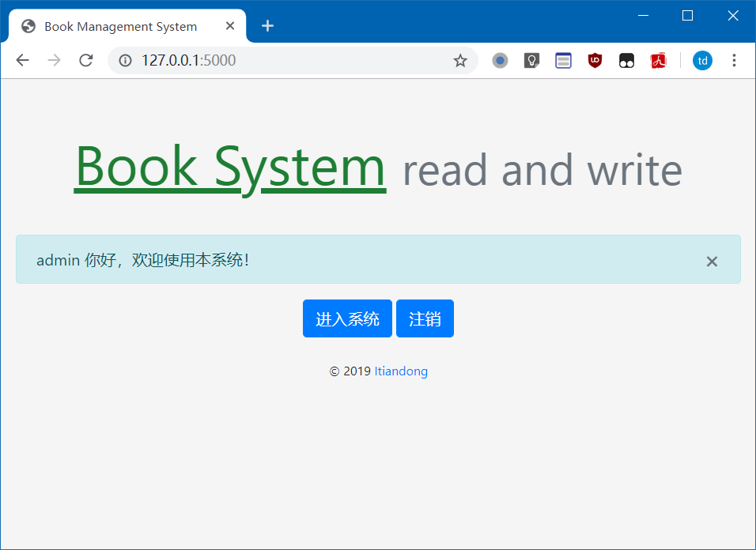

### 注册、登录


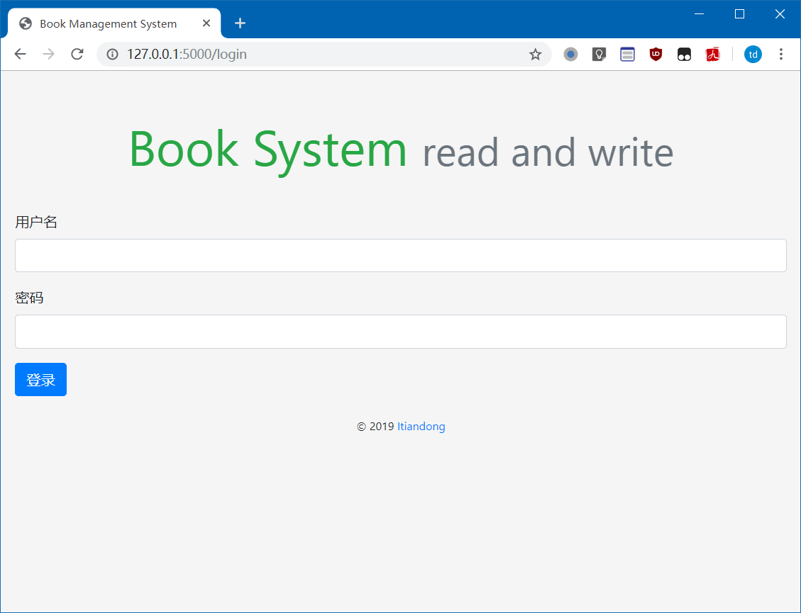

### 搜索

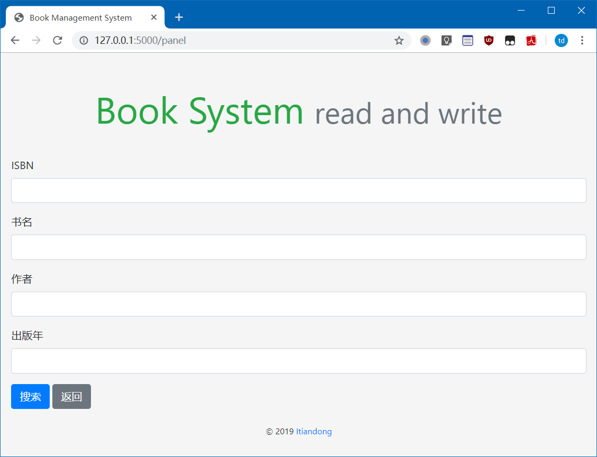

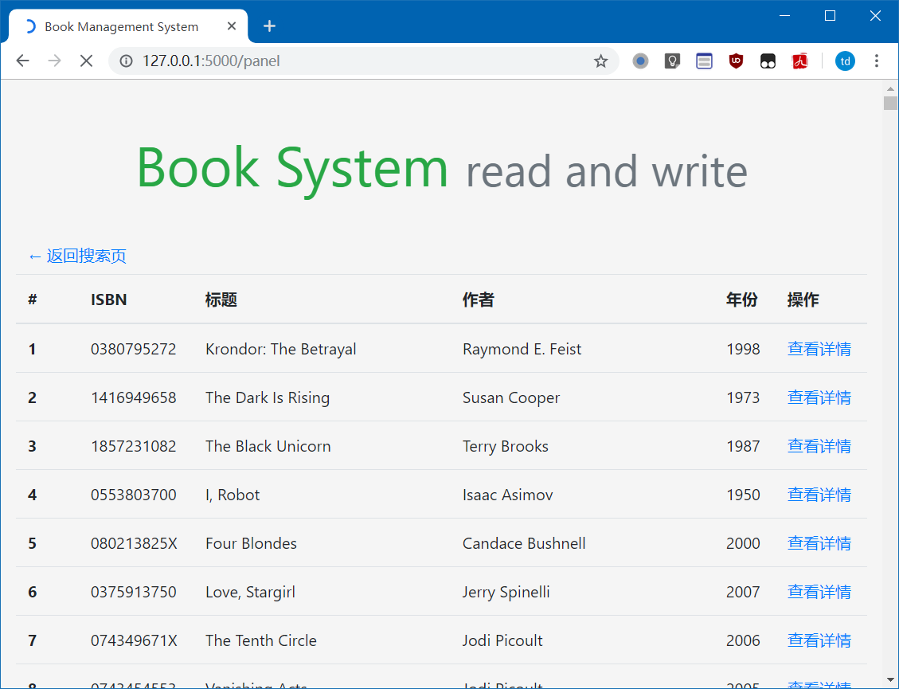

### 图书详情页

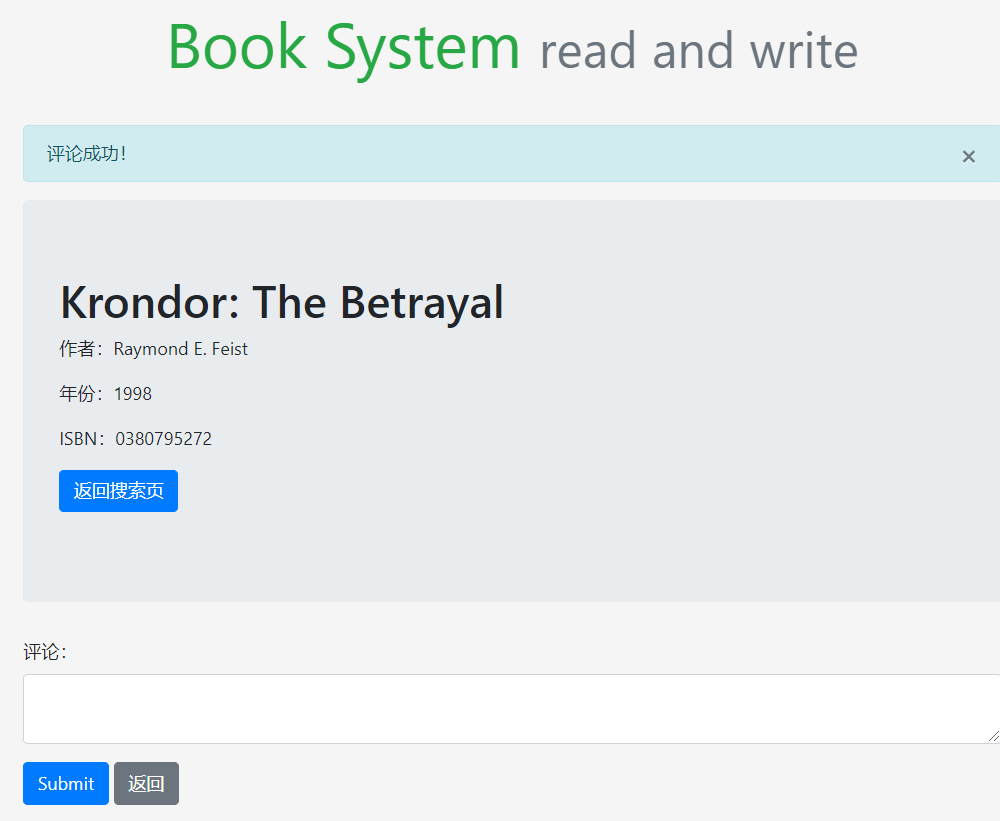

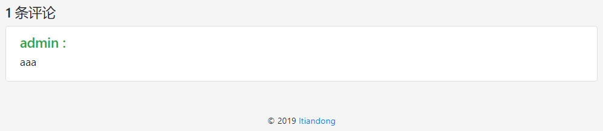

### api

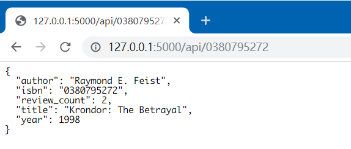


